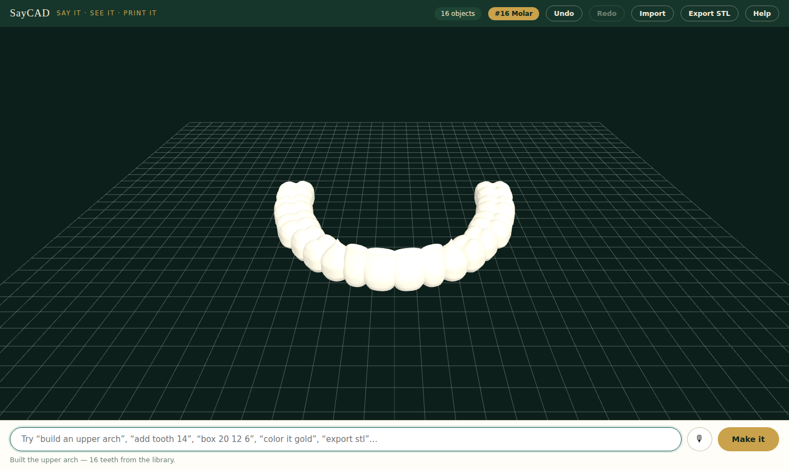
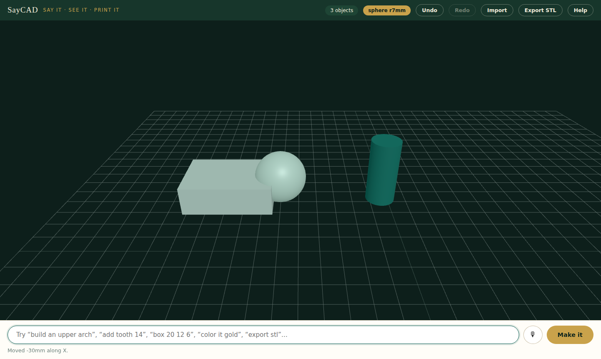

# SayCAD

**Say it. See it. Print it.**

SayCAD is a CAD system you talk to. Describe what you want — typed or spoken —
and it builds real, millimeter-accurate 3D geometry in front of you, ready to
export as an STL and put on a printer.

We're training it on dentistry first, because that's the work we know: crowns,
arches, dentures, scan-fitted restorations at a working dental lab. But the
goal is bigger than teeth — a tool where anyone can describe a part, a fixture,
a prototype of anything, and walk away with a printable model.



## Try it

```bash
npm install
npm run dev
```

Then talk to the command bar (the 🎙 button uses your browser's built-in
speech recognition — Chrome/Edge/Safari; no cloud key needed):

| Say | It does |
| --- | --- |
| `build an upper arch` | places all 16 upper teeth from the procedural library |
| `add tooth 14` | one crown, seated at its natural arch position (Universal 1–32) |
| `add a molar` / `incisor` / `canine` | nearest tooth of that class |
| `box 24 16 8` · `cylinder 4 18` · `sphere 7` | primitives, dimensions in mm |
| `move it right 20` · `rotate it 30` · `scale it 120%` | manipulate the current object |
| `color it gold` · `paint it wax` | brand shades or any CSS color |
| `duplicate it` · `delete it` · `clear` · `undo` | session verbs |
| `import a scan` | load an STL/PLY (a 3Shape arch export works) |
| `export stl` | download the whole design, ready for a printer |



## How it's built

```
src/core/    the SayCAD engine — extracted from a private dental design suite:
             scene layers (scans locked, designs editable), trackball camera
             rig, reference grid, procedural 32-tooth library, undo stack,
             STL/PLY import/export. three.js only.
src/speak/   the conversational layer — a deterministic, fully-tested command
             grammar (parser.ts) plus Web Speech API dictation (voice.ts).
src/App.tsx  the shell that binds them: commands → scene mutations, every one
             undoable.
```

The grammar is deliberately deterministic today: every phrase the app claims
to understand is pinned by a test. The planned LLM front-end will compile free
speech down to **this grammar** — not to raw scene mutations — so the model
can get smarter while the engine stays predictable and testable.

The tooth library is 100% procedural (three.js primitives + math). There is no
scanned anatomy or license-encumbered data in this repository.

## Status & roadmap

This is **v0.1 — a working seed**, extracted and made public on day one.

The next major piece is designed and specified: **[the Corrective Engine](docs/corrective-engine.md)** —
a plan → build → critique → repair loop that validates its own work with
computable critics (watertightness, wall thickness, joint clearance, buoyancy,
assembly paths), and when it gets stuck, opens a research branch and resumes
from a checkpoint instead of starting over. The document includes the complete
worked example: a 300 mm, 9-part, chlorine-proof fish that floats upright in a
pool — buoyancy math, ballast stability, and all.

- [x] Talkable scene: teeth, arches, primitives, transforms, color, undo/redo
- [x] Voice input (browser-native), STL/PLY import and export
- [ ] LLM front-end: free-form speech compiled to the command grammar
- [ ] Boolean/sculpt operations (cutback, offset, boolean subtract for dies)
- [ ] Scan-fitted work: margin lines, seat-to-scan snapping (the Suite editor's
      workflow, being ported)
- [ ] Parametric part templates beyond dental — "a bracket with two M4 holes"

## Provenance & license

SayCAD is built in the open. Its engine was extracted from a private,
production dental design suite — which is why dentistry is the first training
domain: the geometry, the tolerances, and the test discipline come from real
manufacturing work, not a demo.

© 2026 the SayCAD authors. Source is public so you can watch it grow; all
rights reserved while a license is chosen. Tests: `npm test` (64 passing).
